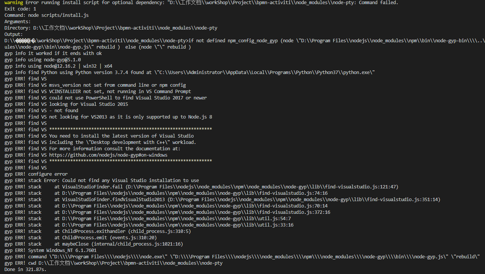

## 创建页面

在pages目录下创建文件夹

config/route.config.js 增加路由配置

## CSS/LESS

使用的CSS modules写法

## jwt集成

fetch配置（utils/request.js (isomorphic-fetch)）

1）在headers中配置Authorization字段，用于统一校验登录状态。

2）在headers中配置post请求传参格式application/x-www-form-urlencoded

```javascript
import {stringify} from 'qs';

function postData(url, data) {
  // Default options are marked with *
  return fetch(url, {
    body: stringify(data), // must match 'Content-Type' header
    cache: 'no-cache', // *default, no-cache, reload, force-cache, only-if-cached
    headers: {
        'Authorization': 'xxxxxxxxxx',
        'Content-Type': 'application/x-www-form-urlencoded; charset=utf-8',
    },
    method: 'POST', // *GET, POST, PUT, DELETE, etc.
  })
  .then(response => response.json()) // parses response to JSON
}
```

## Menu权限控制

src\models\menu.js 

menuData为服务器获取，控制只显示哪些路由。

menuData会更新route中的auth字段，控制该路由页面中的具体页面元素是否可用。

## 全局样式


## 接口形式
```json
{
    "code":200,
    "msg":"success",
    "data" : []
}
```
## 按需加载


## refs不能使用

## 注释规范

保证类和函数级别的注释

## 单个文件不能超过500行

## history.push()不要携带数据，刷新的时候会丢失

## DVA（Redux）

```
  |---- put (action)
  |<--reducer--| 
Models -- call --> Services(fetch)
  ^                   |
  |                   |
  |<------yield-------|
```

## Umi
Router，环境区分，按需加载，Mock，部署

## 布局

采用Ant.design提供的Grid布局方式，需要兼容sm和md两种屏幕。

## 公共组件应该是不涉及业务功能的组件。 

## 环境变量
测试和线上打包，如果指定域名需要使用config.js中的define功能处理。目前增加了apiUrl来控制接口请求的地址。

## 升级问题

* 升级后，由于 `umi-ui` 的问题，在 `yarn install` 时会出现以下错误，提示缺少 `Python` 环境，但是不影响实际运行跟使用：


